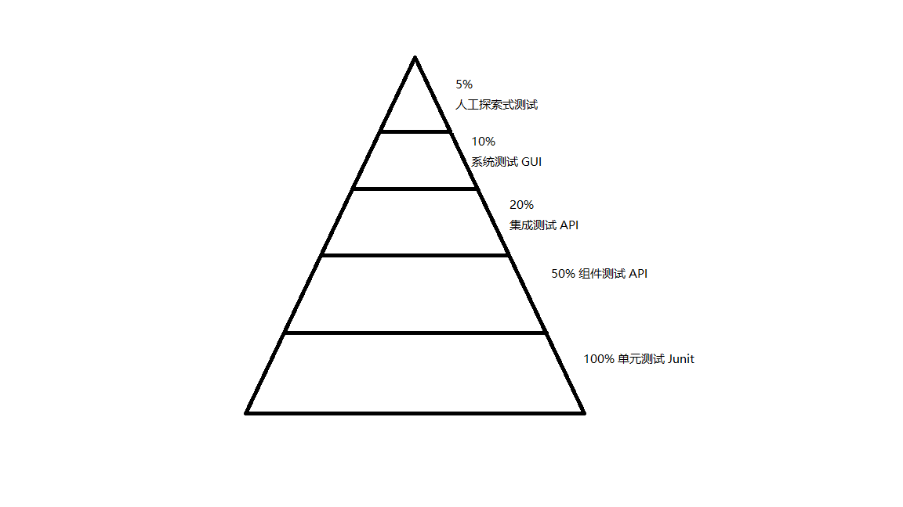

<<<<<<< HEAD
# 自动化测试

## 1.自动化测试金字塔

---

## 1.1 单元测试
    在金字塔额底部是单元测试，这些测试由程序员编写，供程序员自己使用。编写这些测试的目的是在最低层次上定义系统。

---
## 1.2 组件测试
    通常针对系统的各个组件而编写，组件测试围绕组件而写，它向组件中传入数据，然后收集数据。它会测试实际输出是否符合预期的输出。组件测试由QA人员和业务人员编写，开发人员提供辅助。
---
## 1.3 集成测试
 **Baidu**
   
    集成测试（也叫组装测试，联合测试）是单元测试的逻辑扩展。它最简单的形式是：把两个已经测试过的单元组合成一个组件，测试它们之间的接口。从这一层意义上讲，组件是指多个单元的集成聚合。在现实方案中，许多单元组合成组件，而这些组件又聚合为程序的更大部分。方法是测试片段的组合，并最终扩展成进程，将模块与其他组的模块一起测试。最后，将构成进程的所有模块一起测试。此外，如果程序由多个进程组成，应该成对测试它们，而不是同时测试所有进程。
**个人理解**
    
    这些测试将组件装配成组，测试他们彼此之间相互是否能正常通信，集成测试是编排性测试。它们不会测试业务规则，而是主要测试组件装配在一起是否协调。

---
## 1.4 系统测试
 **Baidu**

    系统测试，英文是System Testing。是对整个系统的测试，将硬件、软件、操作人员看作一个整体，检验它是否有不符合系统说明书的地方。这种测试可以发现系统分析和设计中的错误。如安全测试是测试安全措施是否完善，能不能保证系统不受非法侵入。再例如，压力测试是测试系统在正常数据量以及超负荷量(如多个用户同时存取) 等情况下是否还能正常地工作。
**个人理解**

    这些测试是针对整个系统完毕的系统来运行的自动化测试，是最终的测试。它们不会直接测试业务规则，而是测试系统是否已正确组装完毕，以及系统的各个组成部分之间是否能正确交互，在这个层次的测试集中，应该包含吞吐率测试，和性能测试

---
## 1.5 人工探索式测试
    人工介入，非自动化测试，盲测。
=======
自动化测试
=========

>>>>>>> 20b9cfb26d817aab3a193b3790c3773dc1a601f8
